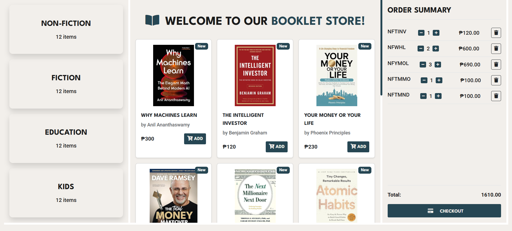

# Booklet - E-Commerce Website

A responsive e-commerce website for browsing and purchasing books across various categories.


## 🛠️ Tech Stack

### Frontend
| Technology | Purpose |
|------------|---------|
|  | Page structure |
|  | Styling |
|  | Dynamic functionality |
|  | Responsive layout |
|  | Icons |

### Build & Deployment
| Technology | Purpose |
|------------|---------|
|  | Version control |
|  | Hosting |

## Features

### Core Functionality
- **Category Navigation** (Non-Fiction, Fiction, Education, Kids)
- **Book Display** with covers, details, and prices
- **Interactive Shopping Cart**:
  - Add/remove items
  - Quantity adjustment (± buttons)
  - Real-time total calculation
  - Checkout system

## Project Structure
```
booklet-store/
├── assets/
│ ├── css/
│ │ └── styles.css # Custom styles
│ ├── js/
│ │ ├── data.js # Book database
│ │ └── populate.js # DOM manipulation
│ └── img/ # Book cover images
├── index.html # Main application entry
```

## Quick Start

1. Clone the repo:
   ```bash
   git clone https://github.com/yourusername/booklet-store.git
   cd booklet-store

2. Open in browser
    ```
    open index.html  # Or double-click the file
    ```