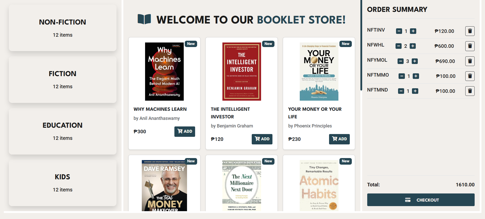

# Booklet - E-Commerce Website

A responsive e-commerce website for browsing and purchasing books across various categories.

## Live Demo

**[Experience Booklet Store Now](https://binibiningjenna.github.io/booklet/v1-static/)**



## Technology Stack

### Version 1 (Static Frontend)

| Technology                                                                                               | Purpose               | Used in                 |
| -------------------------------------------------------------------------------------------------------- | --------------------- | ----------------------- |
|                 | Page structure        | `index.html`, `assets/` |
|                    | Styling               | `assets/css/styles.css` |
|  | Dynamic functionality | `assets/js/populate.js` |
|     | Responsive layout     | All pages               |
|  | Hosting               | Live deployment         |

### Version 2 (PHP)

| Technology                                                                                               | Purpose           | Used in                    |
| -------------------------------------------------------------------------------------------------------- | ----------------- | -------------------------- |
|                       | Backend logic     | `version-2/BE/*.php`       |
|                 | Database          | `version-2/BE/booklet.sql` |
|  | Frontend logic    | `version-2/FE/script.js`   |
|    | API communication | `version-2/FE/script.js`   |
|                 | Local server      | Development setup          |

### Shared Technologies

| Technology                                                                                                    | Purpose         | Used in Both Versions |
| ------------------------------------------------------------------------------------------------------------- | --------------- | --------------------- |
|                            | Version control | Entire repository     |
|  | Icons           | UI elements           |

## Features

### Core Functionality

- **Category Navigation** (Non-Fiction, Fiction, Education, Kids)
- **Book Display** with covers, details, and prices
- **Interactive Shopping Cart**:
  - Add/remove items
  - Quantity adjustment (± buttons)
  - Real-time total calculation
  - Checkout system

## Dual Version Architecture

```booklet/
├── v1-static/          # Original static version (hosted)
│   ├── assets/         # CSS, JS, images
│   └── index.html      # Entry point
│
├── v1-php/             # PHP fullstack version
│   ├── BE/             # Backend
│   │   ├── booklet.sql
│   │   ├── categories.php
│   │   ├── connect.php
│   │   └── products.php
│   │
│   └── FE/             # Frontend
│       ├── img/        # Book covers
│       ├── script.js   # Updated fetch logic
│       ├── styles.css
│       └── index.html
│
└── README.md           # This documentation
```

## Dual Version System

### v1-static (Hosted Frontend)
- **Location**: `/v1-static`
- **Tech**: HTML/CSS/JS
- **Access**: [Live Demo](https://binibiningjenna.github.io/booklet/v1-static/)

### v1-php (Fullstack Local)
- **Location**: `/v1-php`
- **Tech**: PHP/MySQL + Frontend
- **Setup**:
  ```bash
  cd v1-php/FE
  php -S localhost:8000

## Quick Start

1. Clone the repo:

   ```bash
   git clone https://github.com/yourusername/booklet-store.git
   cd booklet-store

   ```

2. Open in browser
   ```
   open index.html  # Or double-click the file
   ```
